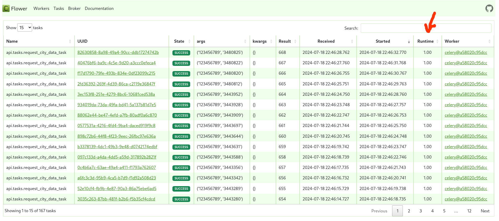

# Open Weather Integration

This project design and build a service that collects data from an Open Weather API assync and then store it.

## Specifications

These are the specifications for this project:

- All the logic is built using Python 3;
- The application must do async calls to Open Weather API to get weather information from the cities indexed by the file 'cities.csv';
- The application must respect Open Weather free account limit, exactly 60 requests per minute (or 1 per sec);
- An account at Open Weather API it's necessary, each account has a code that must be send to the API;
- Code needs to have more than 90% of test coverage;
- Open git repository (preferable in github);
- Docker must be used to set up the environment, therefore a Dockerfile must exist in the project.

## Set up

Follow these steps to run the project, you just need docker, and the plugin docker compose installed in your machine.

1. Clone the project in you local machine;
2. Open a terminal in the root folder of the project;
3. Create a file **.env**;
4. Copy the content of the file **.dev.env** to the **.env** file;
5. Replace OPEN_WEATHER_API_KEY variable for your Open Weather API Key Account;
6. Run the command: ```docker compose up --build -d```;
7. Ready, you can access the services of the project.

## Infrastructure

To build this application I chose these technologies:

- **Django**: a robust Python web framework, it provides tools for testing, routing, db communication and much more;
- **Celery**: a service to run asynchronous tasks, acting besides Django, I chose to use just one queue, one worker and keep only one concurrency processor, the tasks are going to be executed one by one;
- **MySQL**: is used for storage, as it is commonly employed in simple and small applications.

## Using the application

After setting up the environment, with the Docker containers running, the main service is accessible on port 8000 and it's possible to send requests to it. First you need to send the POST request, with the user_id inside the parameters, this id must be unique, you can use any string as ID, limited to 100 characters, if the ID already exists the API will reply an error message and a 409 status code. If you have **curl** installed on your machine you can use this command to test the application:

```bash
curl -X POST -d "user_id=123456789" localhost:8000
User 123456789 created, requests inserted on queue.
```

Once the post is sent the user is registered in the system and all the cities in the list 'cities.csv' are going to be requested for that user. Each request means a celery task, it's possible to monitor the requests using the celery flower interface, you just need to open [localhost:5555](http://localhost:5555/tasks) on your favorite browser. In this monitoring tool you can see that each task takes at least one second to execute, this condition was implemented inside the task, to grant that the application will never exceed Open Weather Free account limit. You can see a proof of this in this image:



Then you can perform a GET request to check the percentage of how many requests are still complete for that user:

```bash
curl localhost:8000?user_id=123456789
14.37125748502994
```

In this case **14.37%** of the requests to the user **123456789** were completed in the moment that the GET request was done. When all the requests to the user is completed this request will return **100.00**.

Each request executed by celery stores the data about the cities listed in the 'cities.csv' file. It's easy to consult and check this data on the mysql container:

```bash
docker exec -it mysql mysql -u root -p"rootpassword" -D default_database -e "SELECT * FROM api_usercityrequest WHERE user_id = '123456789' LIMIT 10;"
```

This is the prompted result:

```bash
mysql: [Warning] Using a password on the command line interface can be insecure.
+-----+----------------------------+---------+----------------------------+-------------+----------+-----------+
| id  | created_at                 | city_id | city_name                  | temperature | humidity | user_id   |
+-----+----------------------------+---------+----------------------------+-------------+----------+-----------+
| 502 | 2024-07-18 22:43:46.633077 | 3439525 | Young                      |         286 |       90 | 123456789 |
| 503 | 2024-07-18 22:43:47.627751 | 3439781 | Treinta y Tres             |         284 |       89 | 123456789 |
| 504 | 2024-07-18 22:43:48.650467 | 3440645 | Departamento de San Jos�  |         287 |       89 | 123456789 |
| 505 | 2024-07-18 22:43:49.675145 | 3442098 | La Paz                     |         287 |       77 | 123456789 |
| 506 | 2024-07-18 22:43:50.561049 | 3442778 | Delta del Tigre            |         287 |       77 | 123456789 |
| 507 | 2024-07-18 22:43:51.589439 | 3443341 | Carmelo                    |         286 |       84 | 123456789 |
| 508 | 2024-07-18 22:43:52.504953 | 3442233 | Jose Batlle y Ordonez      |         283 |       90 | 123456789 |
| 509 | 2024-07-18 22:43:53.599981 | 3440781 | Rivera                     |         286 |       94 | 123456789 |
| 510 | 2024-07-18 22:43:54.693496 | 3441572 | Departamento de Montevideo |         287 |       77 | 123456789 |
| 511 | 2024-07-18 22:43:55.519993 | 3441575 | Montevideo                 |         287 |       77 | 123456789 |
+-----+----------------------------+---------+----------------------------+-------------+----------+-----------+
```

We have **city_name**, **temperature** and **humidity**. All these data are coming from Open Weather API and stored on the local DB storage.

## Executing Tests

All the tests were implemented inside **api/tests** using django default test engine. You can easily execute then inside the app container using these commands:

```bash
docker exec app coverage run --source api manage.py test api
docker exec app coverage report -m
```

The first command executes the tests using the **coverage** package. The second command prompt the coverage package report. The expected output is as follows:

```bash
Name                                     Stmts   Miss  Cover   Missing
----------------------------------------------------------------------
api/__init__.py                              0      0   100%
api/admin.py                                 1      0   100%
api/apps.py                                  4      0   100%
api/cities.py                               19      0   100%
api/migrations/0001_initial.py               6      0   100%
api/migrations/__init__.py                   0      0   100%
api/models.py                               19      0   100%
api/open_weather_adapter.py                 13      0   100%
api/tasks.py                                16      0   100%
api/tests/__init__.py                        0      0   100%
api/tests/test_cities.py                    25      0   100%
api/tests/test_models.py                    28      0   100%
api/tests/test_open_weather_adapter.py      13      0   100%
api/tests/test_tasks.py                     21      0   100%
api/tests/test_user_controller.py           16      0   100%
api/tests/test_views.py                     40      0   100%
api/urls.py                                  3      0   100%
api/user_controller.py                       9      0   100%
api/views.py                                17      0   100%
----------------------------------------------------------------------
TOTAL                                      250      0   100%
```

Meaning that 100% percent of the project is covered by tests.
